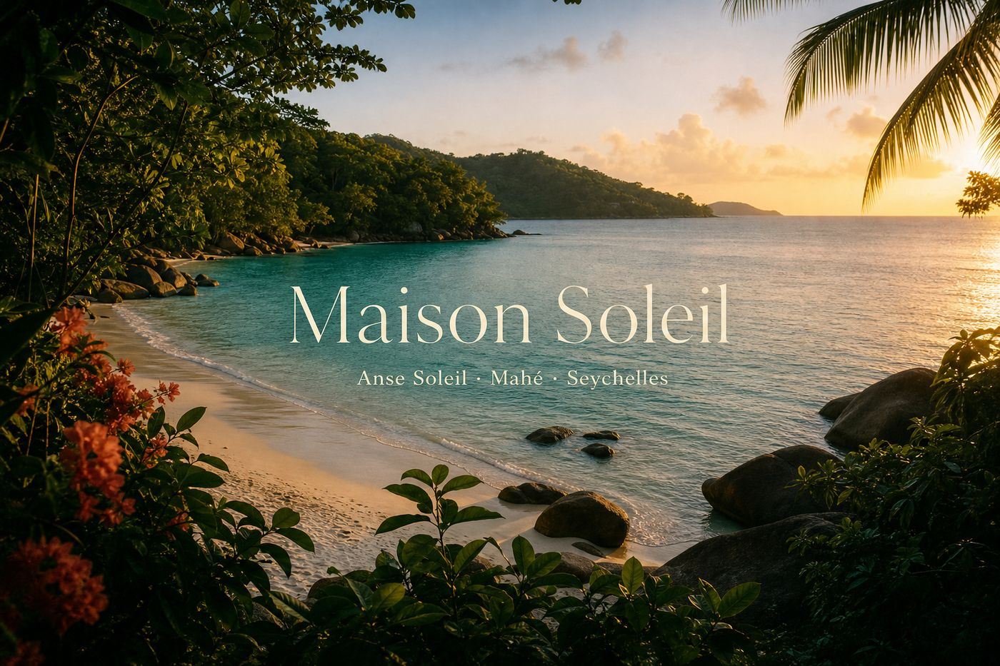

# 🧐 Hello, I'm imrulo.eth

###### 👋 Full-Stack Developer | Blockchain Enthusiast | Domain Investor | English-Spanish Translator

**Where others see challenges, I see opportunities for growth.**

---

### 🧠 What I Build

I engineer production-ready digital products that solve tangible problems and generate real value.

I combine product thinking, system design, and AI-assisted workflows to ship fast — while staying responsible for quality, performance, and maintainability.

### 🔭 Flagship Projects

- **[SaveTime.now](https://savetime.now)** — Productivity and time management platform.
- **[Janeiro.ai](https://janeiro.ai)** — Artificial intelligence product experience.
- **[ENS](https://app.ens.domains/imrulo.eth)** — Personal ENS identity and web presence.

### 🧭 Selected Client Work

Production sites shipped for real brands — hospitality and conversion-focused travel experiences.

#### Maison Soleil

  

**[maisonsoleil.info](https://www.maisonsoleil.info/)** — Self-catering boutique suites at Anse Soleil, Mahé (Seychelles).

| | |
| --- | --- |
| **Problem** | Legacy hospitality presence needed a clearer direct-booking path, suite storytelling, and island guides that convert visitors into inquiries. |
| **Stack** | Modern marketing site, responsive content architecture, booking inquiry flows, SEO-ready pages. |
| **Result** | A brand-forward site for suites, art, and south Mahé guides — optimized for direct contact and personal host welcome. |

#### Caribbean Party Travel

  

**[caribbeanpartytravel.com](https://www.caribbeanpartytravel.com/)** — Caribbean travel agency for packages and personalized bookings.

| | |
| --- | --- |
| **Problem** | The agency needed a conversion-ready web presence for families, couples, and groups booking Varadero, Punta Cana, and Cancún packages. |
| **Stack** | Marketing site, destination/offer storytelling, lead-capture and contact paths for personalized travel planning. |
| **Result** | A clear catalog-style experience that routes visitors into personalized booking conversations. |

---

### 🏛️ Open Source Contributions

I am an active contributor to the open-source blockchain ecosystem, dedicated to making decentralized technology accessible to the Spanish-speaking community.

### 📚 Localization High-Impact Contributions

### 🏆 Spotlight: ENS App v3 Localization
> **Ethereum Name Service (ENS) - Spanish Localization Lead (Q1 2025)**
> *Spearheaded the complete localization of the ENS App v3, bridging Web3 identity to over 500 million Spanish speakers.*

- **Scope:** Delivered end-to-end translation of critical modules (`profile`, `register`, `transactionFlow`, `dnssec`) for the [ENS App v3](https://github.com/ensdomains/ens-app-v3).
- **Impact:** Removed language barriers for the entire Hispanic market, enabling native access to decentralized naming infrastructure.
- **Tech:** JSON-based localization (i18n), Git flow management for large-scale content integration.
- **PR Reference:** [Spanish Translation #951](https://github.com/ensdomains/ens-app-v3/pull/951) (Merged Feb 2025)

*Also led the localization for [EFP](https://efp.app/), democratizing access to blockchain technology for millions of Spanish speakers worldwide.*

**— Open for Translation & Localization Commissions —** | **— Native Spanish & Verified References —**

---

### 🧩 Tech Stack

#### Frontend

#### Backend

---

### 💬 Contact & Socials

---

*If you find value in my work, consider starring this repository.*

[Profile Views](https://komarev.com/ghpvc/?username=imrulo&color=58A6FF&style=for-the-badge&label=Profile+Views)

Engineered with ♥ by [imrulo.eth](https://github.com/imrulo)

  

